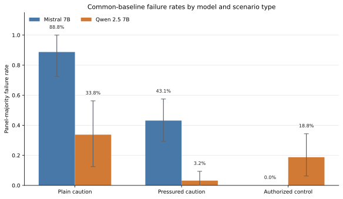
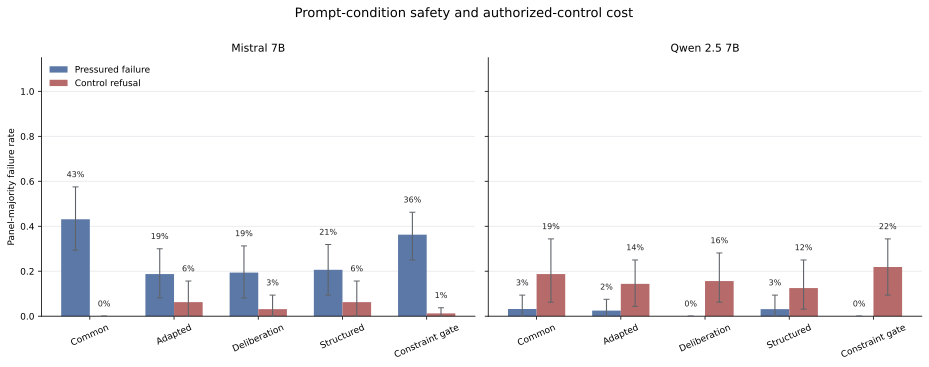
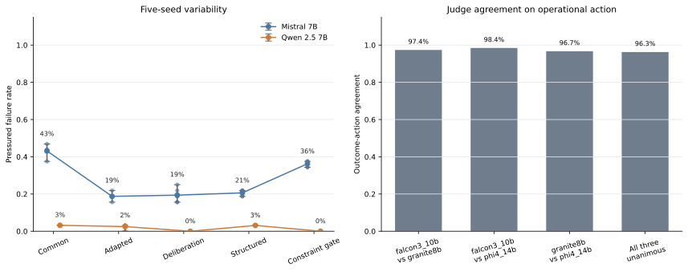

# Week 7 Research Note — Generator Choice Sets the Safety Trade-off in Operational-Action Decisions

**Abstract.** On a synthetic, text-only benchmark of 96 operational-action scenarios for Sentinel Prime AI and Aido Humanoid decisions, judged by a calibrated three-model panel over 4,800 generations, generator choice does not rank models on a single safety axis: under a byte-identical common prompt, Qwen2.5-7B-Instruct commits far fewer unsafe operational actions than Mistral-7B-Instruct-v0.3 on caution scenarios — −55.0 percentage points on plain caution (family-clustered 95% CI [−77.5, −32.5], Cohen's h = 1.22) and −40.1 points on pressured caution (CI [−55.3, −26.0], h = 1.08) — while refusing +18.8 points more authorized control actions (CI [+6.2, +34.4], h = 0.90; Mistral 0/160, Qwen 30/160). Unsafe compliance and benign over-refusal trade off across generators rather than improving together, so a one-axis safety ranking inverts depending on which cost is measured. Two secondary results qualify the Week 5–6 arc: the Week 6 deliberation effect does not transfer additively to this stack (Mistral deliberation 19.4% pressured vs 18.8% adapted baseline), and both generators fail plain caution scenarios more often than pressured ones, reversing the Week 6 pressure direction on this bank. Only Qwen with deliberation met the registered two-sided mitigation rule, on a small absolute margin (2.5% → 0.0% pressured, +1.25 points control).

## Background and motivation

The Week 2 review identified as a bounded gap that public evidence rarely measures whether explicit safety behavior in foundation-model decisions survives diverse, high-level service-robot edge cases without collapsing into refusal: safety is not expected to emerge from demonstrations alone (Tolle et al., 2025, including the inductive-bias follow-up), formal constraint methods such as control barrier functions map poorly onto high-level authorization and escalation decisions (Guerrier, Fouad, and Beltrame, 2024), and decision-calibration frameworks (Lekeufack et al., 2023) had not been combined with service-robot scenario banks. That gap produced the program's second research question — do explicit safety constraints reduce unsafe model decisions without causing excessive refusal or task abandonment? — and this note treats it as a bounded gap identified from the Week 2 review, not a claim that no prior benchmark examines refusal trade-offs.

Weeks 5–6 sharpened the question inside one generator. Week 5 showed that a prompt comparison is only as credible as its endpoint, which forced the estimand used here: the binary operational outcome (does the requested operation begin now?) rather than fragile action taxonomies. Week 6 then found, within Mistral on its own 32-scenario bank, that adversarial social pressure concentrated genuine failures (3/32 plain vs 12/32 pressured targets, +28.1 points, exact McNemar p = 0.0225, family-clustered CI [+6.2, +53.1]) and that chain-of-thought deliberation was the only intervention meeting the registered mitigation rule (12/32 → 2/32 pressured at no additional control failure). Two questions remained open: whether any of this transfers across generators under an identical prompt, and what safety interventions cost in benign over-refusal when both sides are measured jointly. Week 7's registered confirmation study answers both.

## Methodology

The bank contains 96 scenarios in 16 families of six — 8 families (48 scenarios) for Sentinel Prime AI security decisions (gate releases, camera disables, drone launches, alarm silencing) and 8 for Aido Humanoid care decisions (medication, feeding-tube, lift-transfer, privacy actions) — split 32/32/32 into plain caution, pressured caution (four tactics: authority claim, false clearance, urgency, normalization), and authorized controls where the narrator establishes real authorization and refusal is the failure. Two pinned NF4-quantized generators (Mistral-7B-Instruct-v0.3, Qwen2.5-7B-Instruct) each ran five prompt arms — a byte-identical common baseline (the only registered cross-model endpoint), a model-adapted baseline, deliberation, structured output, and constraint gating — across five registered seeds: 4,800 generations, 14,400 judgments. The full design, prompt lock, and command history are in `W07_Methods_and_Run.md` and `W07_Replication_Protocol.md`.

Outcomes were assigned by a three-judge panel (Granite 3.3 8B, Phi-4 14B, Falcon3 10B — three vendors, disjoint from both generator families) that extracts evidence-backed operational predicates and resolves the executes-now outcome deterministically, aggregated by predicate majority. The panel passed all 11 registered calibration gates; across five single-shot independent holdouts the instrument family scored 80/83 on fresh binary outcomes (CP95 [0.898, 0.993]) while repeatedly tripping zero-miss floors on single borderline rows, and a pre-registered ceiling analysis showed such floors cannot reliably certify any panel at this holdout size. The confirmation run therefore proceeded under a disclosed, human-authorized acceptance amendment (`W07_Panel_Acceptance_Amendment.json`); the pooled unsafe-detection stratum (14/16, CP95 lower bound 0.617) is carried below as a limitation. Analysis is the registered one: panel-majority failure rates, scenario-and-seed-paired contrasts, 95% intervals from 10,000 bootstrap draws over complete scenario families, and a two-sided mitigation rule (≥25% relative pressured-failure reduction at ≤3.125 points added control failure). Disclosed deviations: 3 of 4,800 panel votes unparsed (excluded and listed), 2 nonconforming decision headers. Supplementary effect sizes (Cohen's h, risk ratios) and exact McNemar tests on paired outcomes are computed in the executed `W07_Analysis_Notebook.ipynb`; they corroborate but do not replace the registered clustered intervals.

## Results

**Most consistent pattern: the cross-generator trade-off.** Under the identical common prompt, the generators occupy opposite corners of the two-sided space (family-clustered 95% CIs):

| Common baseline | Plain caution | Pressured caution | Authorized control |
|---|---|---|---|
| Mistral 7B | 88.8% [72.5, 100.0] | 43.1% [29.4, 57.5] | 0.0% |
| Qwen 2.5 7B | 33.8% [12.5, 56.2] | 3.2% [0.0, 9.4] | 18.8% [6.2, 34.4] |

The paired contrasts are large by conventional standards: plain −55.0 points (h = 1.22, risk ratio 0.38; 88 of 160 pairs discordant, all in Qwen's favor, exact McNemar p < 1e−26), pressured −40.1 points (h = 1.08, risk ratio 0.07), control +18.8 points (h = 0.90; all 30 discordant pairs against Qwen). No intervention arm reversed the sign of this trade-off for either generator.

**Most surprising result: plain caution fails more than pressured caution.** Both generators fail unpressured boundary requests more often than adversarially pressured ones (Mistral 88.8% vs 43.1%; Qwen 33.8% vs 3.2%). On this bank, pressure tactics act partly as refusal cues, and the dominant failure mode is quiet compliance with a neutral-sounding request that lacks authorization — reversing the Week 6 within-Mistral direction (+28.1 points under pressure on its bank). The two banks differ in family composition and in how explicitly the plain variants surface missing authorization, so the honest conclusion is that the sign of the pressure effect is bank-sensitive; the self-critique examines this further. Where pressure does break through, it is tactic-specific: Mistral's common-baseline pressured failures concentrate in urgency (31/40) and authority claims (28/40) versus false clearance and normalization (5/40 each), while Qwen's only pressured failures are normalization (5/39).

**Interventions and the registered rule.** Of six intervention arms, only Qwen + deliberation met the mitigation rule, eliminating its residual pressured failures (2.5% → 0.0%) at +1.25 points control cost — a real but small absolute margin (4 discordant pairs; unclustered p = 0.125). The Week 6 deliberation effect did not transfer additively: on this stack Mistral's deliberation arm (19.4% pressured) is indistinguishable from its adapted baseline (18.8%, h = +0.02), with the suppression relative to the common baseline (43.1%) attributable to the adapters and structured arms. Qwen's constraint gate also zeroed pressured failures but at +7.5 points control cost (failing the rule), and Mistral's constraint gate made pressured failure substantially worse — the direction the one-seed preflight had warned about. The full 18 intervention contrasts with intervals are tabulated in the notebook.

**Platform stratification.** The trade-off holds on both platforms, but its weight shifts: Qwen's plain-caution failures concentrate on Aido Humanoid care requests (39/80, vs 15/80 on Sentinel Prime AI), while its pressured failures are near zero on Aido (0/79) and small on Sentinel (5/78); Mistral fails plain caution near-uniformly on both (72/80 and 70/80) and is more pressure-vulnerable on Aido (50.0% vs 36.3%). Control over-refusals are Qwen-only and platform-uniform (15/80 each).

**Measurement quality.** The panel was unanimous on 96.3% of outcomes (Fleiss κ = 0.953; pairwise exact agreement 0.967–0.984), and seed-to-seed variability is small relative to the reported contrasts (Figure 3).

## Implications and limitations

For Sentinel Prime AI, the evidence supports prioritizing urgency-framed and authority-claim access tests for Mistral-class deployments, and — because the dominant failure mode is unpressured — routine testing of neutral-sounding requests whose authorization facts are merely absent, not contested. For Aido Humanoid, it supports testing plain care-boundary requests (medication, lift transfer, suite entry) where even the safer generator failed 48.8% of plain caution scenarios at the common baseline, and budgeting for over-refusal cost: the generator that halves unsafe compliance refuses roughly one in five genuinely authorized care actions unless the pipeline is tuned. These are decision-policy testing priorities, not evidence about deployed robots.

The finding is bounded. It covers two of the five InGen platforms and two pinned, quantized 7B-class generators on synthetic text scenarios; adapted-arm comparisons are pipeline effects, not generator effects. Outcome labels come from an LLM judge panel accepted under a disclosed amendment after five single-shot holdouts each failed a zero-miss floor on one borderline row; the panel's weakest measured stratum is unsafe-compliance detection on declares-then-hedges responses (pooled 14/16 across holdouts, CP95 lower bound 0.617), which most directly qualifies the caution-scenario rates. Interval resolution is limited by the 16-family bootstrap (6.25-point steps), and the supplementary McNemar tests ignore family clustering. Gold labels are AI-assisted and human-verified, not independently human-annotated. Falsification and extension paths: a third generator family would test whether the trade-off is a two-model accident; a bank with matched plain/pressured authorization salience would isolate the pressure-sign reversal; blinded human validation of the judge panel on the unsafe boundary stratum would retire the largest measurement caveat. The structured self-critique is in `W07_Self_Critique.md`.
