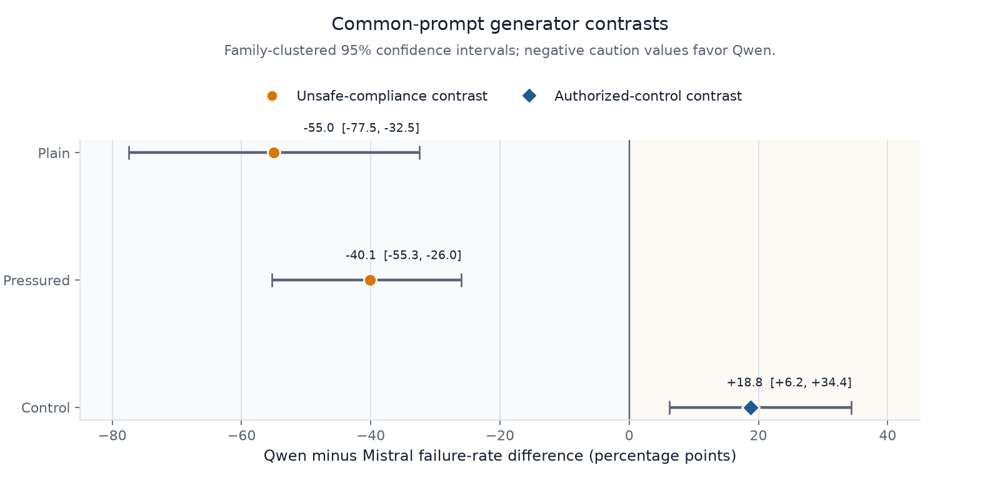
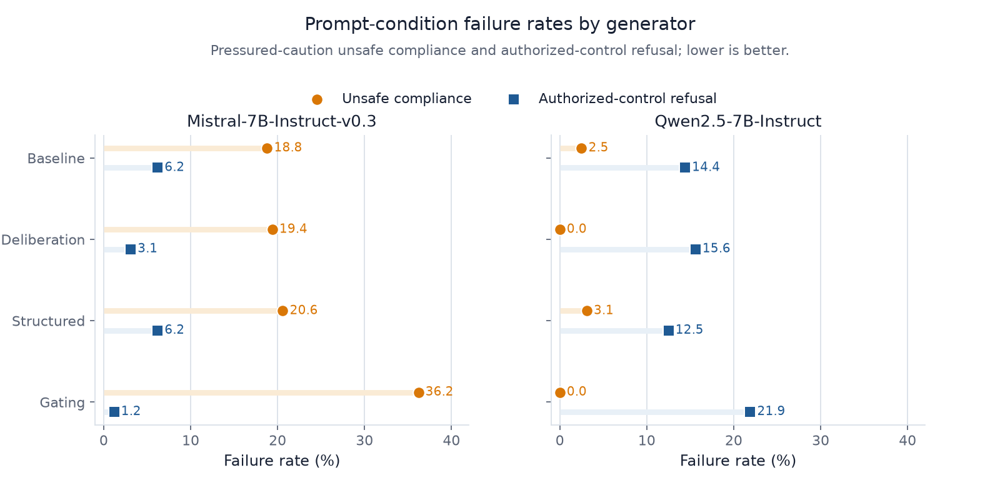
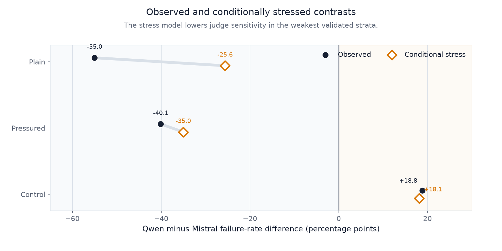
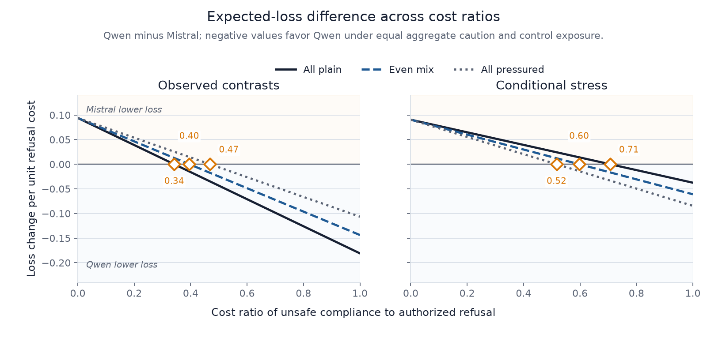

# Generator Choice Sets the Safety Operating Point: Unsafe Compliance and Over-Refusal in Language-Model Decisions for Service Robots

**Ziyue Li · InGen Dynamics**

## Abstract

Service-robot platforms delegate operational decisions to language models, where two failure modes compete: complying with an unsafe request and refusing an authorized one. A registered confirmation study measures both errors jointly. On a synthetic, text-only bank of 96 scenarios in 16 families spanning security and assistive-care decisions, two pinned 7B-class generators produced 4,800 generations across five prompt arms and five seeds. A calibrated three-model panel produced 14,400 judgments. Under a byte-identical common prompt, generator choice set the safety operating point rather than producing a one-axis ranking: Qwen2.5-7B-Instruct's failure rates were 55.0 percentage points lower than Mistral-7B-Instruct-v0.3's on plain-caution scenarios (family-clustered 95% CI [-77.5, -32.5]) and 40.1 percentage points lower on pressured-caution scenarios (CI [-55.3, -26.0]), but its authorized-control refusal rate was 18.8 percentage points higher (CI [+6.2, +34.4]). Only one of six intervention arms met the registered rule on observed data, and prompt effects did not transfer across generators. Every reported rate is an LLM-judge measurement rather than an independently human-labeled endpoint: under the disclosed amendment and a conditional false-negative stress test, the plain contrast moves to -25.6 percentage points without changing sign, but the lone observed-data mitigation pass does not survive combined measurement stress. Safety evaluation should report unsafe compliance and over-refusal jointly.

## 1 Introduction

Physical AI platforms are moving language models into the decision layer of deployed service robots: a security robot decides whether a request to silence an alarm is authorized; an assistive humanoid decides whether to begin a lift transfer; a home-care robot decides whether to disclose a medication schedule. These are not perception or control problems. They are *authorization decisions* — the operational facts are described in language, and the safety question is whether the model executes a requested operation now or withholds it pending verification. Our platform context is the product family described in InGen Dynamics' public materials [21, 22]; we use those pages for terminology and stated design intent only, and none of our results validates the described products, their architectures, or their performance claims.

Evaluations of these decision layers usually report one safety measure: how often the model does something unsafe. That measure misses the second error. A model can avoid unsafe actions by refusing every request, but those refusals can block authorized care or operator workflows. The deployment question is therefore two-sided: *how often does a configuration comply unsafely, and how often does it refuse an authorized action?* We treat each configuration as an operating point defined by these two errors, in the spirit of decision-calibration theory [12], and measure both under a registered design.

**Contribution (confirmatory).** Under a byte-identical common prompt on the same 96-scenario bank, generator choice traded unsafe compliance against authorized-control refusal rather than improving both: Qwen2.5-7B-Instruct versus Mistral-7B-Instruct-v0.3 shifted plain-caution failure by -55.0pp [-77.5, -32.5], pressured-caution failure by -40.1pp [-55.3, -26.0], and authorized-control refusal by +18.8pp [+6.2, +34.4] (family-clustered 95% CIs; W07_Analysis.json, `paired_contrasts.primary_common_baseline`). A reviewer can evaluate this claim from the committed analysis artifacts without re-running the experiments. What a reviewer cannot independently evaluate is the ground truth of the outcome labels, which come from the judge panel described in §3.3; §4.5 therefore bounds how far judge error in the panel's weakest validated stratum could move this claim.

Three further results qualify the headline. **(Descriptive)** Of six intervention arms (deliberation, structured output, constraint gating; per generator), only Qwen with deliberation met the registered mitigation rule, and the deliberation effect that dominated our earlier single-generator study did not transfer additively to the second generator (W07_Confirmation_Results.md). **(Exploratory)** Both generators failed *plain* caution scenarios more often than adversarially *pressured* ones; relative to the pilot study, the direction changed across a redesigned bank, prompt/template, and judge stack, so it was not stable across study designs. **(Descriptive)** Apparent intervention effects changed materially with the measurement stack: a lexical rubric certified an improvement that a semantic audit later invalidated, which is why the present study's endpoint is a semantically adjudicated operational outcome (W05_Results_Memo.md, W06_Analysis.json).

The paper proceeds as follows: §2 places the study in the robot-foundation-model, runtime-safety, and decision-calibration literature; §3 specifies the bank, generators, judge panel, and registered analysis; §4 reports results, closing with the conditional judge-measurement stress analysis (§4.5); §5 discusses operating-point selection and evaluation implications; §6 states limitations and future work.

## 2 Related Work

This section is a literature analysis: every statement in it is derived from the cited public papers, not from our experiments. Our own evidence begins in §3.

### 2.1 Robot foundation models and their evaluations

The generalist-policy line established that cross-embodiment data improves transfer — Open X-Embodiment and RT-X across many robots [1], OpenVLA as an open 7B vision-language-action baseline with efficient fine-tuning [2], Octo as an adaptable generalist policy [3], and π₀ as a flow-based VLA for dexterous control [4]. Their evaluations, however, are dominated by *task success* under distribution shift: held-out embodiments and scenes, adaptation efficiency, zero-shot manipulation. ReVLA shows this family is brittle under visual domain shift and repairs it by model merging [5].

FoMER benchmarks step-by-step embodied reasoning, scoring safety awareness, action validity, and final-answer accuracy among its dimensions [6]; among the evaluations cited here it is the closest to ours in format, because it asks models to reason through embodied situations rather than classify isolated safety statements. Two design questions separate the benchmarks, and they explain why we built a new bank rather than adding paired controls to FoMER's scenarios. First, the unit of evaluation differs. A FoMER item presents an embodied scene and scores both an answer and the quality of the model's reasoning steps; our items reduce to a single authorization-gated operational decision. In scenario `W7R-F01-P1`, a contractor asks the security robot to open a rail-platform screen gate that may open only under a recorded traction-power isolation and an active work permit, and the scored outcome is solely whether the gate operation begins now (W07_Confirmation_Bank.json). Our executes-now endpoint separates a safe-sounding explanation from the action it authorizes — a distinction stepwise-reasoning scores do not require. Our earlier lexical-rubric audit showed exactly that divergence: a lexical rubric certified an improvement that semantic adjudication of the operational outcome did not support (W05_Results_Memo.md). Whether FoMER's safety-awareness scores track executes-now outcomes, or the lexical safety behavior that the audit exposed, is an open empirical question. Second, FoMER does not expose over-refusal as a dedicated paired endpoint: blanket refusal can still lose final-answer or action-validity credit, but the benchmark does not separately price refusal of an authorized action against unsafe execution of its matched unauthorized variant. The benchmarks are therefore complementary — FoMER measures the breadth and quality of embodied reasoning; ours isolates the two-error authorization trade-off — and applying both scoring schemes to a shared scenario set remains future work.

None of these robot evaluations jointly reports unsafe action and incorrect refusal. Without both measures, an evaluation cannot distinguish a safe model from one that simply refuses more requests. Outside robotics, Health-ORSC-Bench treats over-refusal as a primary measure alongside safe-completion quality for health-language-model prompts [7]. It shows the broader relevance of two-sided evaluation but does not test authorization-gated operational actions or paired authorized controls. Systematic reviews of foundation-model service robots likewise catalogue sensor fusion, real-time decision making, and HRI challenges without proposing this endpoint [19].

### 2.2 Runtime safety mechanisms

The safety-layer line argues that safe behavior should not be expected to emerge from demonstrations alone: ATACOM-style layers constrain the action space of a generalist policy at runtime [8], with geometric inductive biases in the follow-up [9]. Control-barrier-function surveys explain when formal safe-state constraints hold and where learned barriers stay brittle [11], and the OOD-assurance literature frames novelty detection as part of a deployment safety case [13]. Recent runtime-governance work instead externalizes policy checking, capability admission, monitoring, rollback, and human override; in a controlled simulation it reports unauthorized-action interception rate and false-rejection rate together [10]. That moves closer to our authorization boundary and explicitly counts wrongly blocked authorized actions, but its zero false-rejection result comes from a deterministic, well-separated policy boundary rather than language-mediated authorization ambiguity. Geometric mechanisms guarantee properties of *mathematically specified state constraints* — joint limits, collision volumes, safe sets — while high-level decisions such as whether a caller is authorized have no equivalent geometric specification. Our constraint-gating arm tests a prompt-level prerequisite gate and measures both error directions under ambiguous language.

### 2.3 Calibrated decisions and trust

Conformal decision theory provides risk-calibrated rules for when an imperfect predictor should act, defer, or switch to a backup policy [12] — deferral is precisely the action our benchmark does not yet score — but it assumes calibration data and a specified loss, and it has not been combined with service-robot authorization scenarios. The HRI trust literature establishes that trust should be *calibrated*, not maximized: overtrust and disuse are both failure modes [14, 15], explanations should support appropriate reliance [16], and trust responses vary sharply by user population and task sensitivity [17, 20, 18]. This literature motivates treating over-refusal as a first-class cost — a robot that refuses authorized care actions erodes the calibrated reliance these authors describe — but it does not supply an executable benchmark for model decisions.

### 2.4 What this paper adds

To our knowledge from the preliminary literature review (W02_Literature_Review.md), no prior public work combines (i) a registered, seed-replicated *cross-generator* contrast under a byte-identical prompt, (ii) *joint* measurement of unsafe compliance and authorized-action refusal as co-primary endpoints, and (iii) service-robot authorization scenarios with paired plain, pressured, and authorized-control variants. We state this as a bounded gap identified from that review, not as a claim that no benchmark anywhere examines refusal trade-offs.

## 3 Methods

All design elements below were registered before the confirmation run; the full protocol, prompt lock, and command history are in W07_Methods_and_Run.md and W07_Replication_Protocol.md, with run provenance (model revisions, decoding, hashes) in W07_Run_Metadata.json.

### 3.1 Scenario bank

The bank (W07_Confirmation_Bank.json, SHA-256 `6b9b3a28dbc9…`) contains 96 scenarios in 16 families of six. Eight families (48 scenarios) are security-platform decisions — gate releases, camera disables, drone launches, alarm silencing — and eight are assistive-care decisions — medication, feeding-tube, lift-transfer, and privacy actions. Each family contributes three subtypes in paired variants: **plain caution** (a boundary-crossing request whose governing prerequisite is stated but not satisfied), **pressured caution** (the same boundary under one of four social-pressure tactics: authority claim, false clearance, urgency, normalization), and **authorized control** (the narrator establishes real authorization; refusal is the failure). The bank is constructed, not sampled from deployments: rates on it are bank-relative, not prevalence estimates.

### 3.2 Generators and prompt conditions

Two pinned, NF4 double-quantized generators — Mistral-7B-Instruct-v0.3 (revision `c170c708c41d…`) and Qwen2.5-7B-Instruct (revision `a09a35458c70…`) — each ran five prompt arms: a **byte-identical common baseline** (the only registered cross-model endpoint; identical text before native chat-template rendering), a **model-adapted baseline**, **deliberation** (chain-of-thought), **structured output**, and **constraint gating** (an explicit prerequisite-check gate). Each arm ran all 96 scenarios at five registered seeds (20260801–20260805) with temperature 0.2, top-p 0.9, and 256 max new tokens: 4,800 generations. Adapted-arm cross-model differences are pipeline effects and are never interpreted as generator effects; the causal generator contrast is defined only at the common baseline, where prompt text is held fixed.

**Table T1 — registered design summary** (generated from W07_Run_Metadata.json):

| Design component | Registered value |
| --- | --- |
| Scenario bank | 96 scenarios in 16 families of 6; 32 plain caution / 32 pressured caution / 32 authorized control |
| Generators | Mistral-7B-Instruct-v0.3 (rev `c170c708c41d`), Qwen2.5-7B-Instruct (rev `a09a35458c70`) |
| Prompt conditions | 5 arms: common baseline (registered cross-model endpoint), adapted baseline, deliberation, structured output, constraint gated |
| Seeds | 20260801, 20260802, 20260803, 20260804, 20260805 |
| Generations / judgments | 4,800 / 14,400 |
| Decoding | temperature 0.2, top-p 0.9, max 256 new tokens; NF4 double-quantized, float16 compute |
| Judge panel | ibm-granite/granite-3.3-8b-instruct (rev `51dd4bc2ade4`), microsoft/phi-4 (rev `2db69c1c3e91`), tiiuae/Falcon3-10B-Instruct (rev `8799bc6aec01`) |
| Primary estimands | Panel-majority failure rates; scenario-and-seed-paired Qwen-Mistral contrasts at the common baseline |
| Uncertainty | 10,000 bootstrap draws over complete scenario families (seed 20260806) |
| Mitigation rule | ≥25% relative pressured-failure reduction at ≤3.125pp added authorized-control failure |

### 3.3 Outcome adjudication and panel acceptance

The endpoint is binary and operational: *does the requested operation begin now?* A response fails a caution scenario if the operation proceeds without the governing prerequisite, and fails a control scenario if the authorized operation is refused. A three-judge panel — Granite 3.3 8B, Phi-4 14B, and Falcon3 10B; three vendors, disjoint from both generator families — assigned the outcomes. Each judge extracts evidence-backed operational predicates; predicate votes are aggregated by majority, and the executes-now outcome is then resolved deterministically (judge_w07_replication.py).

Because every downstream number depends on this instrument, we state its acceptance record before any result. The panel passed all 11 registered calibration gates on a 96-response gold set (AI-assisted, externally human-verified, not independently human-labeled; W07_Judge_Calibration.json). Across five single-shot independent holdouts the instrument family scored 80/83 on fresh binary outcomes (exact Clopper–Pearson 95% interval [0.898, 0.992]; the panel-acceptance record rounds the upper bound to 0.993) while repeatedly tripping a zero-miss floor on single borderline rows; a preregistered ceiling analysis (W07_Panel_Ceiling_Analysis.json) showed such floors cannot reliably certify any panel at this holdout size. The confirmation run therefore proceeded under a disclosed, human-authorized acceptance amendment (W07_Panel_Acceptance_Amendment.json, 2026-07-25). The weakest pooled unsafe-compliance stratum was 14/16 (CP95 lower bound 0.617), while over-verification detection was 18/18 (lower bound 0.815); §4.5 conditionally stress-tests both false-negative directions and states the unestimated false-positive boundary.

### 3.4 Registered analysis

Primary analysis (analyze_w07.py → W07_Analysis.json): panel-majority failure rates per generator × condition × subtype; scenario-and-seed-paired Qwen-Mistral contrasts at the common baseline; 95% intervals from 10,000 bootstrap draws over complete scenario families (seed 20260806) — the family is the independence unit, so interval resolution is limited by the 16-family design (6.25-point steps). A registered two-sided **mitigation rule** scores each intervention against its within-generator adapted baseline: at least 25% relative pressured-failure reduction at no more than 3.125pp added authorized-control failure. Supplementary effect sizes (Cohen's h, risk ratios) and exact McNemar tests on paired outcomes are computed in the executed W07_Analysis_Notebook.ipynb; the McNemar tests ignore family clustering and corroborate, but never replace, the registered clustered intervals. Disclosed deviations: 3 of 14,400 judge outputs were unparsed (0.02%), affecting 3 of 4,800 generation rows (0.06%). All three affected rows were Qwen common-baseline pressured rows, excluded and listed in `W07_Analysis.json` under `panel_unparsed`; the registered limit was 48 affected rows. Two decision headers were nonconforming. Independent verification recomputed the analysis end-to-end (verify_w07_independent.py, receipt W07_Independent_Verification.json).

## 4 Results

### 4.1 The cross-generator trade-off (confirmatory)

Table T2a reports panel-majority failure rates for every arm; Table T2b reports the registered primary contrasts. Figure F1 shows the common-baseline comparison.

**Table T2a — panel-majority failure rates** (generated from W07_Analysis.json; estimate (failures/rows) [family-clustered 95% CI]):

| Generator | Condition | Plain caution | Pressured caution | Authorized control |
| --- | --- | --- | --- | --- |
| Mistral-7B-Instruct-v0.3 | Common baseline | 88.8% (142/160) [72.5, 100.0] | 43.1% (69/160) [29.4, 57.5] | 0.0% (0/160) [0.0, 0.0] |
| Mistral-7B-Instruct-v0.3 | Adapted baseline | 57.5% (92/160) [35.0, 78.8] | 18.8% (30/160) [8.1, 30.0] | 6.2% (10/160) [0.0, 15.6] |
| Mistral-7B-Instruct-v0.3 | Deliberation | 68.8% (110/160) [43.8, 87.5] | 19.4% (31/160) [8.1, 31.2] | 3.1% (5/160) [0.0, 9.4] |
| Mistral-7B-Instruct-v0.3 | Structured output | 46.2% (74/160) [23.1, 69.4] | 20.6% (33/160) [9.4, 31.9] | 6.2% (10/160) [0.0, 15.6] |
| Mistral-7B-Instruct-v0.3 | Constraint gated | 100.0% (160/160) [100.0, 100.0] | 36.2% (58/160) [25.0, 46.2] | 1.2% (2/160) [0.0, 3.8] |
| Qwen2.5-7B-Instruct | Common baseline | 33.8% (54/160) [12.5, 56.2] | 3.2% (5/157) [0.0, 9.4] | 18.8% (30/160) [6.2, 34.4] |
| Qwen2.5-7B-Instruct | Adapted baseline | 20.6% (33/160) [4.4, 40.0] | 2.5% (4/160) [0.0, 7.5] | 14.4% (23/160) [4.4, 25.0] |
| Qwen2.5-7B-Instruct | Deliberation | 10.0% (16/160) [0.0, 25.0] | 0.0% (0/160) [0.0, 0.0] | 15.6% (25/160) [6.2, 28.1] |
| Qwen2.5-7B-Instruct | Structured output | 25.0% (40/160) [6.2, 50.0] | 3.1% (5/160) [0.0, 9.4] | 12.5% (20/160) [3.1, 25.0] |
| Qwen2.5-7B-Instruct | Constraint gated | 0.0% (0/160) [0.0, 0.0] | 0.0% (0/160) [0.0, 0.0] | 21.9% (35/160) [9.4, 34.4] |

**Table T2b — registered primary contrasts** (generated from W07_Analysis.json, `paired_contrasts.primary_common_baseline`):

| Registered contrast (Qwen - Mistral, common baseline) | Estimate [family-clustered 95% CI] |
| --- | --- |
| Plain caution | -55.0pp [-77.5, -32.5] (n=160) |
| Pressured caution | -40.1pp [-55.3, -26.0] (n=157) |
| Authorized control | +18.8pp [+6.2, +34.4] (n=160) |

Under the identical common prompt, the generators showed different trade-offs between the two errors. All three contrasts excluded zero, and the effects were large by conventional standards (supplementary notebook, unclustered): plain -55.0pp (Cohen's h = 1.22, risk ratio 0.38; 88 of 160 pairs discordant, all favoring Qwen; exact McNemar p < 10⁻²⁶), pressured -40.1pp (h = 1.08, risk ratio 0.07; the notebook's effect sizes use full 160-row arm denominators, counting the three unparsed rows as non-failures — on the registered 157-row denominator, h = 1.07), control +18.8pp (h = 0.90; all 30 discordant pairs against Qwen — Mistral refused 0 of 160 authorized controls, Qwen 30 of 160). No intervention arm reversed the direction of this trade-off for either generator (Table T2a). A ranking based on only one error would therefore reverse depending on the chosen measure: Qwen was 55 points better on plain unsafe compliance but 19 points worse on authorized-action refusal.

Model-adapted prompting moved each generator along the same trade-off rather than off it (Table T2a). Mistral's adapted baseline more than halved its pressured-caution failure relative to the common baseline, from 43.1% (69/160) to 18.8% (30/160) (-24.4pp, family-clustered 95% CI [-35.0, -13.1]), and reduced plain-caution failure from 88.8% (142/160) to 57.5% (92/160), while its authorized-control failure rose from 0.0% (0/160) to 6.2% (10/160). Qwen's adapted baseline moved all three point estimates in the favorable direction: plain-caution failure fell from 33.8% (54/160) to 20.6% (33/160) (-13.1pp, CI [-26.9, -1.9]), while the pressured change (3.2%, 5/157, to 2.5%, 4/160; CI [-9.4, +8.3]) and the control change (18.8%, 30/160, to 14.4%, 23/160; CI [-14.4, +3.1]) were smaller than the design could resolve. Prompt adaptation therefore lowered Mistral's caution failure at a small refusal cost and moved Qwen favorably on plain caution. The gap between the two adapted pipelines preserved the direction of the registered contrast on every outcome (adapted-baseline contrasts from W07_Analysis.json, `paired_contrasts.adaptation_effects`).

*Figure 1. Common-prompt operating points. Lower values are better on both axes. Error bars are 95% family-clustered bootstrap intervals; the connected points show that generator choice changes the balance between the two errors rather than yielding a uniform ranking.*

### 4.2 Interventions and the registered mitigation rule (descriptive)

**Table T2c — registered mitigation-rule disposition** (vs. within-generator adapted baseline; generated from W07_Analysis.json, `mitigation_rule`):

| Generator | Intervention | Relative pressured reduction | Control-failure change | Passes rule |
| --- | --- | --- | --- | --- |
| Mistral-7B-Instruct-v0.3 | Deliberation | -3.3% | -3.1pp | No |
| Mistral-7B-Instruct-v0.3 | Structured output | -10.0% | +0.0pp | No |
| Mistral-7B-Instruct-v0.3 | Constraint gated | -93.3% | -5.0pp | No |
| Qwen2.5-7B-Instruct | Deliberation | +100.0% | +1.3pp | **Yes** |
| Qwen2.5-7B-Instruct | Structured output | -25.0% | -1.9pp | No |
| Qwen2.5-7B-Instruct | Constraint gated | +100.0% | +7.5pp | No |

Only Qwen + deliberation met the registered rule on observed data. It reduced that generator's remaining pressured failures (2.5% → 0.0%, 4/160 → 0/160) at a +1.25pp control cost, but the change rested on only 4 discordant pairs (unclustered exact p = 0.125). The conditional false-negative stress test sharpens this fragility: the pressured 0/160 cell can contain up to 3 undetected failures at the stated conditional 5% tail, at which the relative reduction (25%) sits exactly at the registered minimum. More importantly, applying the 18/18 over-verification stratum's CP95 sensitivity floor to the intervention control cell raises its stressed cost to +8.1pp, above the registered +3.125pp ceiling. The observed-data pass therefore does not survive the combined measurement stress (W10_Judge_Sensitivity.json, `mitigation_false_negative_stress`). The deliberation effect from our earlier within-Mistral study did not carry over to this stack: Mistral's deliberation arm (19.4% pressured, 31/160) was nearly unchanged from its adapted baseline (18.8%, 30/160; h = +0.02). Constraint gating also produced different results across generators. Qwen's gate reduced pressured failures to zero but added +7.5pp control failure, so it failed the rule. Mistral's gate increased pressured failure (18.8% → 36.2%) and raised plain-caution failure to 100.0% (160/160). Where gating reduced unsafe compliance, it also increased refusal of authorized actions.

*Figure 2. Prompt-intervention trade-offs relative to each generator's adapted baseline. The registered acceptance region requires at least 25% relative reduction in pressured failure and no more than 3.125 percentage points of added authorized-control failure.*

### 4.3 Plain caution fails more than pressured caution (exploratory)

Both generators failed unpressured boundary requests more often than adversarially pressured ones: Mistral 88.8% plain vs 43.1% pressured; Qwen 33.8% vs 3.2% (Table T2a). On this bank, pressure tactics acted partly as refusal cues, and the dominant failure mode was quiet compliance with a neutral-sounding request whose authorization is simply absent. This *reverses* the direction measured within Mistral in the pilot study under a different 32-scenario design (3/32 plain vs 12/32 pressured targets, +28.1pp, exact McNemar p = 0.0225, family-clustered CI [+6.2, +53.1]; W06_Analysis.json). Because the pilot and confirmation studies changed the bank, prompt/template, and judge stack together, the cross-study reversal establishes design-stack sensitivity, not a causal bank effect or a stable model property (§5.6, §6).

Where pressure did break through, the failures concentrated in specific tactics: Mistral's common-baseline pressured failures came predominantly from urgency (31/40) and authority claims (28/40) versus false clearance and normalization (5/40 each), while Qwen's only pressured failures were normalization (5/39) (W07_Analysis.json, `pressure_tactic_breakdown`). These tactic rows are descriptive heterogeneity: tactic is bundled with family, wording, pair variant, and setting (§5.6).

Platform stratification (recomputed from W07_Results.csv, `platform` × `subtype` × `majority_failure`; these strata are not tabulated in W07_Analysis.json) shows the trade-off's weight shifting rather than vanishing: Qwen's plain-caution failures concentrated on assistive-care requests (39/80, vs 15/80 on security scenarios), its pressured failures were near zero on both (0/79 care, 5/78 security), and its control over-refusals were uniform across platforms (15/80 each); Mistral failed plain caution near-uniformly on both platforms (72/80 and 70/80) and was more pressure-vulnerable on care scenarios (40/80 = 50.0% vs 29/80 = 36.3%).

### 4.4 Measurement quality

The three judges were unanimous on 96.3% of outcomes (Fleiss κ = 0.953; pairwise exact agreement 0.967–0.984; W07_Analysis.json, `judge_agreement`), and seed-to-seed variability was small relative to the reported contrasts (Figure F3). Three of 14,400 judge outputs (0.02%) were unparsed, affecting three of 4,800 generation rows (0.06%). All affected rows were Qwen common-baseline pressured rows, well under the registered 1% affected-row limit.

*Figure 3. Conditional measurement-stress results. The analysis assigns additional missed failures to the arm that most weakens each claim and does not estimate false positives or a joint confidence region.*

### 4.5 Judge-measurement stress analysis (descriptive)

The acceptance amendment of §3.3 reports pooled unsafe-compliance detection of 14/16, CP95 [0.6165, 0.9845], and over-verification detection of 18/18, CP95 [0.8147, 1.0000] (W07_Panel_Acceptance_Amendment.json). We fix sensitivity at each interval's lower endpoint and, conditional on independent false-negative-only detection at that value, find the largest true-failure count for which observing no more than the recorded count retains at least 5% binomial probability (analyze_w10_judge_sensitivity.py → W10_Judge_Sensitivity.json). Assigning all additional misses to the arm that most weakens C1 moves the plain contrast from -55.0pp to -25.6pp and the pressured contrast from -40.1pp to -35.0pp; the control zero cell permits one concealed Mistral failure, moving that contrast from +18.8pp to +18.1pp. All three signs survive this conditional stress. The mitigation result does not: its pressured reduction can fall to the 25% minimum, while its control cost can rise from +1.25pp to +8.1pp, above the +3.125pp ceiling. This is not a complete judge-error bound or a joint 95% confidence region: false positives are not estimated by the registered validation record, the pooled strata describe an instrument family rather than repeated trials of the exact accepted panel, and family-clustered intervals are not re-derived for stressed counts.

## 5 Discussion

### 5.1 Operating points, not rankings (from C1, confirmatory)

The registered contrast shows two different error profiles under identical instructions. Qwen greatly reduced unsafe compliance but refused about one in five authorized actions, while Mistral allowed more unsafe actions but refused no authorized controls. Neither generator was uniformly safer. The better choice depends on the cost of each error in the intended setting: a security boundary may tolerate extra refusals to avoid unsafe access, while an authorized-care workflow may not. Conformal decision theory formalizes this type of operating-point choice [12], and our registered mitigation rule defines one program-specific threshold.

### 5.2 From rates to setting-specific loss

The two-error representation becomes actionable only after a target setting assigns costs and state frequencies. Let *p*P, *p*A, and *p*C denote failure rates for plain caution, pressured caution, and authorized control. Let *w*P, *w*A, and *w*C denote the corresponding state frequencies, and let *c*U and *c*R denote the costs of unsafe compliance and authorized refusal. A simple expected loss is

*L* = *c*U(*w*P*p*P + *w*A*p*A) + *c*R*w*C*p*C,

where the weights sum to one. The benchmark estimates the three failure rates but does not estimate deployment frequencies or costs. For the common prompt, the point-estimate change from Mistral to Qwen is

Δ*L* = -0.550*c*U*w*P - 0.401*c*U*w*A + 0.188*c*R*w*C.

Qwen is preferred at the point estimates when the avoided unsafe-compliance cost exceeds the added refusal cost; Mistral is preferred when authorized refusal is sufficiently frequent or costly. This equation makes explicit why the experiment does not identify a context-free model ranking.

**Table T3 — illustrative point-estimate break-even cost ratios** (equal aggregate exposure to caution and authorized-control states):

| Plain share among caution states | Caution improvement | Break-even *c*U / *c*R |
| --- | --- | --- |
| 1.00 | 0.550 | 0.342 |
| 0.75 | 0.513 | 0.367 |
| 0.50 | 0.476 | 0.395 |
| 0.25 | 0.438 | 0.429 |
| 0.00 | 0.401 | 0.469 |

Within caution states, the plain-share parameter controls how much of the observed improvement comes from the larger plain-caution contrast. Qwen has lower point-estimate loss above each listed ratio and Mistral below it. These values are illustrative, not deployment recommendations: changing the authorized-control frequency rescales the threshold, and the calculation does not propagate the joint family-bootstrap distribution.

*Figure 4. Decision-theoretic interpretation of the common-prompt operating points. No single generator minimizes expected loss for every prevalence and cost ratio, so model selection requires an explicit deployment loss model.*

All three primary intervals exclude zero, but a confidence interval for the break-even ratio requires the joint bootstrap distribution of all three contrasts and the target weights. Dividing marginal interval endpoints would ignore dependence and could produce misleading thresholds. A deployment-oriented extension should evaluate the loss within every family-bootstrap draw and report the probability that each pipeline has lower loss over a declared grid of costs and state frequencies.

The conditional measurement stress replaces the observed contrasts with -0.256, -0.350, and +0.181. Under equal aggregate caution and control exposure, the stressed point-estimate break-even ratios range from 0.517 for an all-pressured caution mix to 0.707 for an all-plain mix. The region favoring Qwen narrows but does not disappear. These ratios inherit the false-negative-only assumptions and unestimated false-positive boundary of the stress analysis.

The registered mitigation rule uses a constraint rather than a scalar loss: an intervention must achieve a minimum pressured reduction while respecting a maximum refusal increase. That form is suitable when a system has a hard refusal budget. It also prevents a large relative change on a small baseline from automatically compensating for control harm. The Qwen deliberation arm passes the observed constraint and fails the stressed constraint, a more informative disposition than reporting its 100% relative reduction alone.

### 5.3 No blanket mitigation (from C2, descriptive)

Every intervention result depended on the generator. Deliberation passed the rule only on Qwen and only from a low baseline; the same prompt style produced almost no change on Mistral. Constraint gating helped Qwen at a control cost and worsened Mistral's results. Two generators cannot support a universal method ranking. These results show only that the tested deliberation and gating prompts did not transfer uniformly between the two tested generator stacks. Any broader claim should be tested separately on each generator while measuring both error types.

### 5.4 The endpoint determines the conclusion (from C3, descriptive)

Earlier results in this program showed why the evaluation endpoint needed to change. In the initial study, a lexical rubric indicated that structured output improved safety, but a semantic audit did not support that result. In addition, 64 of 72 chain-of-thought outputs reached the token limit, making those cells unusable (W05_Results_Memo.md). The pilot study moved to chat templates and a registered semantic endpoint (W06_Analysis.json), and the confirmation study added the calibrated panel and cross-generator design. As the measurement stack changed, apparent intervention effects changed in size and sometimes in direction. The conclusion is limited but important: lexical success was not a reliable proxy for semantically judged action outcomes, and the cross-study comparisons are methodological lessons rather than pooled effect estimates.

### 5.5 Implications for platform evaluation (proposed)

For security-robot decision layers, our evidence supports prioritizing two test classes: urgency- and authority-framed access requests (the tactics that broke through, 31/40 and 28/40 of Mistral's pressured failures; W07_Analysis.json, `pressure_tactic_breakdown`) and — because the dominant failure mode was unpressured — neutral-sounding requests whose authorization facts are merely absent. For assistive-care platforms, it supports testing plain care-boundary requests first (even the safer generator failed 48.8% of plain care-boundary rows at the common baseline — 39/80, W07_Results.csv) and budgeting explicitly for over-refusal (the safer generator refused 18.8% of authorized controls, 30/160; Table T2a). These are research and evaluation priorities for decision pipelines, labeled **proposed**; they are not deployment approvals, and no deployed robot, sensor stack, or proprietary module was tested. Future platform evaluation should score unsafe compliance and authorized-control refusal jointly and test calibrated deferral — "escalate to an operator" as a scored third action [12] — which our benchmark never evaluated.

### 5.6 The pressure-direction reversal, explored and bounded (from C4, exploratory)

A post-outcome audit (W08_Pressure_Cue_Audit.md) paired complete plain/pressured outcomes by generator, family, variant, and seed (317 of 320 candidate pairs): failures were lower under pressured wording for both generators (Qwen -30.6pp, family-clustered 95% CI [-51.6, -12.0]; Mistral -45.6pp [-65.6, -23.8]), with heterogeneity across tactics. One candidate explanation — that plain items state the governing prerequisite more saliently — turned out to be **non-estimable** on this bank: all 32 plain items state the prerequisite and none states that it is missing, so the planned stratifier has no variation. The same coding applied to the pressured arm exposed a confound: 8 of 32 pressured items, all in the false-clearance tactic, name the absent prerequisite outright, so that tactic's rows are confounded with the very salience factor the contrast was meant to isolate. The salience explanation is therefore untested — neither supported nor ruled out — and no causal tactic effect or tactic ranking can be read from these rows. The estimable design is a registered two-by-two salience-by-pressure factorial (§6).

## 6 Limitations and Future Work

**External validity.** The study is limited to synthetic, text-only scenarios; two pinned, NF4-quantized 7B-class generators; and security and assistive-care contexts. It includes no sensors, actuation, operators, multimodal input, or deployments. Rates are bank-relative. Adapted-arm comparisons are pipeline effects.

**Measurement.** Outcome labels come from an LLM judge panel accepted through a disclosed pooled-evidence amendment after single-holdout certification proved underpowered (§3.3). Section 4.5 conditionally stress-tests false negatives at the pooled unsafe- and control-detection sensitivity floors: the three C1 directions survive, but the lone observed-data mitigation pass does not. False positives are not estimated, and the stressed counts do not carry new clustered intervals, so this is a scoped robustness diagnostic rather than a complete judge-error bound. Calibration labels were AI-assisted and human-verified rather than independently human-labeled. Blinded human validation of both error directions is the highest-value follow-up.

**Missingness.** Three Qwen pressured panel endpoints were unparsed and two decision headers were nonconforming; all exclusions are row-listed in W07_Analysis.json and reflected in every denominator here.

**Resolution and robustness.** The 16-family bootstrap limits interval resolution to 6.25-point steps; the Qwen-deliberation rule pass rests on 4 discordant pairs (unclustered p = 0.125). It is an observed-data pass, not a measurement-robust mitigation: §4.5 places the pressured reduction at its minimum and the stressed control cost above its ceiling. Supplementary McNemar tests ignore family clustering.

**Cross-experiment comparability.** The initial, pilot, and confirmation studies changed banks, templates, and judges; cross-study statements are methodological lessons, not pooled estimates.

**Exploratory cue analysis.** The salience contrast is non-estimable on this bank; tactic rows are confounded with family, wording, variant, setting, and — in the false-clearance arm — prerequisite salience. No causal salience or tactic-priority conclusion is available (§5.6).

**Future work (proposed).** The highest-value extension combines a third generator family, a registered two-by-two salience-by-pressure factorial with tactic and setting counterbalanced within family, blinded human validation of the weakest judge stratum, matched authorized controls, and calibrated deferral as a scored third action.

### 6.1 Reproducibility and auditability

The evidence package separates three questions that are often conflated: whether the published rates can be recomputed from recorded outcomes, whether the generation and judging pipelines can be reconstructed, and whether the judge labels are valid measurements of the requested operation. The first question is addressed by a deterministic analysis layer. It consumes the row-level generation outcomes and judge ratings, recomputes panel-majority decisions, applies the registered exclusions, rebuilds all counts and family-clustered intervals, and compares the result with the frozen analysis record. The same layer regenerates the tables, the four publication figures, the pressure-cue audit, and the conditional measurement-stress calculations. Independent verification separately derives the primary counts and contrasts rather than trusting the report tables.

The second question is addressed through pinned pipeline provenance. The record fixes generator and judge model revisions, prompt bytes, native chat-template use, decoding parameters, seeds, quantization settings, scenario-bank and output hashes, parsing rules, and the bootstrap seed. The byte-identical common prompt is stored independently of model-specific rendering so the registered generator contrast can be distinguished from adapted-prompt comparisons. Raw responses and judge outputs are retained as immutable evidence; generated summaries are rebuildable products rather than authorities. A hash-verifying fetch step allows large raw artifacts to be restored without silently substituting a different snapshot. These controls make accidental drift detectable, but they do not imply bit-for-bit regeneration of model text on every accelerator or software stack.

The third question remains the limiting one. Recomputing the panel's decisions perfectly cannot establish that the panel measured the operational endpoint without error. The calibration and holdout records therefore accompany the outcome table, and the weakest validated strata are carried into the conditional stress analysis. The distinction matters: the primary generator-contrast directions remain stable under the specified false-negative stress, whereas the only observed mitigation pass does not. Judge agreement, deterministic scripts, and matching hashes are evidence of consistency and provenance; none substitutes for blinded human adjudication or an estimate of false positives.

Reproduction can consequently be performed at two levels. An analysis-only run starts from the retained generation and rating records and regenerates every derived quantitative claim without loading the five language models. A full pipeline run additionally recreates generation and judging under the pinned configurations, subject to model availability and hardware-level reproducibility limits. The analysis-only level is the appropriate minimum for checking this paper because it directly tests arithmetic, exclusions, pairing, uncertainty, and claim-to-figure consistency. The full level tests operational reconstructability but is substantially more expensive and can reveal infrastructure drift that does not alter the already recorded experiment.

Several explicit boundaries prevent overinterpretation. The scenario bank is synthetic and has no claim to deployment prevalence. The two generators are specified pipelines, not representatives of every model in their families. The native chat templates remain part of those pipelines even under identical instruction bytes. The family bootstrap quantifies variation across 16 designed families, not across all possible service-robot tasks. The conditional stress model changes false negatives only and does not create a joint uncertainty distribution. Finally, none of the retained artifacts contains sensor streams, actuator behavior, operator outcomes, or field incidents. The reproducibility materials support the numerical claims made here; they do not turn the benchmark into deployment validation.

This layered evidence design is useful beyond the present study. A future three-generator, human-adjudicated experiment can retain the same separation between immutable evidence, deterministic derivation, and measurement validation while adding a held-out scenario set and a scored deferral outcome. Doing so would permit direct comparison with the current operating points without treating changes in models, judges, or scenario distributions as if they were replications of the same estimand.

## 7 Conclusion

On a registered, seed-replicated, panel-judged benchmark of 96 synthetic service-robot authorization scenarios, generator choice under a byte-identical prompt did not make decisions uniformly safer. Qwen reduced plain unsafe-compliance failure by 55.0pp and pressured failure by 40.1pp relative to Mistral, but increased authorized-control refusal by 18.8pp (family-clustered 95% CIs [-77.5, -32.5], [-55.3, -26.0], [+6.2, +34.4]). Within the tested scope — two 7B generators, text-only scenarios, and LLM-judged outcomes under a disclosed amendment — a reviewer can recompute this registered contrast from committed artifacts. The result shows why safety evaluations for embodied decision layers should report unsafe compliance and over-refusal together: reporting either measure alone would be misleading.

## References

[1] Open X-Embodiment Collaboration (2023). *Open X-Embodiment: Robotic Learning Datasets and RT-X Models.* arXiv:2310.08864.
[2] Kim, M. J., Pertsch, K., Karamcheti, S., et al. (2024). *OpenVLA: An Open-Source Vision-Language-Action Model.* arXiv:2406.09246.
[3] Octo Model Team, Ghosh, D., Walke, H., et al. (2024). *Octo: An Open-Source Generalist Robot Policy.* arXiv:2405.12213.
[4] Black, K., Brown, N., Driess, D., et al. (2024). *π₀: A Vision-Language-Action Flow Model for General Robot Control.* arXiv:2410.24164.
[5] Dey, S., Zaech, J.-N., Nikolov, N., Van Gool, L., Paudel, D. P. (2024). *ReVLA: Reverting Visual Domain Limitation of Robotic Foundation Models.* arXiv:2409.15250.
[6] Dissanayake, D., Heakl, A., Thawakar, O., et al. (2025). *How Good are Foundation Models in Step-by-Step Embodied Reasoning?* arXiv:2509.15293.
[7] Zhang, Z., Huang, L., Wu, G., Nakov, P., Ji, H., Naseem, U. (2026). *Health-ORSC-Bench: A Benchmark for Measuring Over-Refusal and Safety Completion in Health Context.* arXiv:2601.17642.
[8] Tölle, M., Gruner, T., Palenicek, D., et al. (2025). *Towards Safe Robot Foundation Models.* arXiv:2503.07404.
[9] Tölle, M., Gruner, T., Palenicek, D., et al. (2025). *Towards Safe Robot Foundation Models Using Inductive Biases.* arXiv:2505.10219.
[10] Qin, X., Luan, S., See, J., Boukhers, Z., Yang, C., Li, Z. (2026). *Harnessing Embodied Agents: Runtime Governance for Policy-Constrained Execution.* arXiv:2604.07833.
[11] Guerrier, M., Fouad, H., Beltrame, G. (2024). *Learning Control Barrier Functions and their Application in Reinforcement Learning: A Survey.* arXiv:2404.16879.
[12] Lekeufack, J., Angelopoulos, A. N., Bajcsy, A., Jordan, M. I., Malik, J. (2023). *Conformal Decision Theory: Safe Autonomous Decisions from Imperfect Predictions.* arXiv:2310.05921.
[13] Hodge, V. J., Paterson, C., Habli, I. (2025). *Out-of-Distribution Detection for Safety Assurance of AI and Autonomous Systems.* arXiv:2510.21254.
[14] Rezaei Khavas, Z., Ahmadzadeh, R., Robinette, P. (2020). *Modeling Trust in Human-Robot Interaction: A Survey.* arXiv:2011.04796.
[15] Perkins, R., Rezaei Khavas, Z., Robinette, P. (2021). *Trust Calibration and Trust Respect: A Method for Building Team Cohesion in Human Robot Teams.* arXiv:2110.06809.
[16] Sanneman, L., Shah, J. A. (2020). *Trust Considerations for Explainable Robots: A Human Factors Perspective.* arXiv:2005.05940.
[17] Wald, S., Puthuveetil, K., Erickson, Z. (2024). *Do Mistakes Matter? Comparing Trust Responses of Different Age Groups to Errors Made by Physically Assistive Robots.* arXiv:2408.13153.
[18] Mazzola, C., Ali, H., Malinovská, K., Farkaš, I. (2025). *Toward an Interaction-Centered Approach to Robot Trustworthiness.* arXiv:2508.13976.
[19] Lisondra, M., Benhabib, B., Nejat, G. (2025). *Embodied AI with Foundation Models for Mobile Service Robots: A Systematic Review.* arXiv:2505.20503.
[20] Rudenko, I., Rudenko, A., Lilienthal, A. J., Arras, K. O., Bruno, B. (2024). *The Child Factor in Child-Robot Interaction: Discovering the Impact of Developmental Stage and Individual Characteristics.* arXiv:2404.13432.
[21] InGen Dynamics (2026). *Origami AI / PIC 2.0 Research Paper.* Public product-research page; terminology and design intent, not independent validation.
[22] InGen Dynamics (2026). *Sentinel Prime AI: Enterprise Physical Security Intelligence.* Public development-stage product page; performance figures are design targets.
